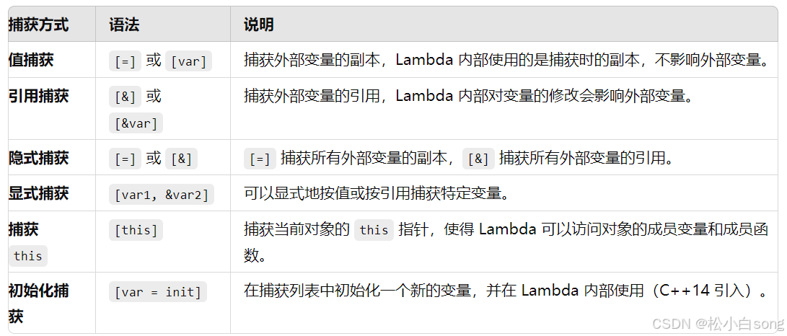

# 关键字

## static：控制变量的存储方式和可见性

- 修饰局部变量  

该变量存储区由栈区变为静态数据区，其生命周期延长到整个程序执行结束，其作用域仍然是一个局部作用域。
该变量的内存只被分配一次，因此其值在下次调用时仍维持上次的值。  

- 修饰全局变量  

改变了其作用域的范围，由原来的整个工程可见（`extern`）变为本源文件可见。  

- 修饰函数  

与修饰全局变量类似，改变了函数的作用域。  

- 修饰C++中的成员函数  

表示该函数属于一个类而不是属于此类的任何特定对象，不接收 `this` 指针，因而只能访问类的 `static` 成员变量。

- 修饰C++ 中的成员变量  

表示该变量为类以及其所有的对象所有。它们在存储空间中都只存在一个副本，可以通过类和对象去调用。

## extern: 外部变量/函数声明引用

- 在 `C` 语言中，修饰变量/函数，表示此变量/函数是在别处定义的，要在此处引用。  
调用其它文件中的变量/函数，只需把该文件用#include包含进来即可，为啥要用 `extern` ？
因为用 `extern` 会加速程序的编译过程，这样能节省时间。  

- 在 `C++` 中 `extern` 还有另外一种作用，用于指示 `C` 或者 `C++` 函数的调用规范。  
在 `C++` 中调用`C` 库函数，`extern “C”` 声明要引用的函数。告诉链接器在链接的时候用 `C` 函数规范来链接。主要原因是 `C++` 和 `C` 程序编译完成后在目标代码中命名规则不同，用此来解决名字匹配的问题。

## volatile: 易变的

- 易变性  

在汇编层面反映出来就是两条语句，下一条语句不会直接使用上一条语句对应的 `volatile` 变量的寄存器内容，
而是重新从内存中读取。  

- 不可优化特性  

`volatile` 告诉编译器不要对变量进行优化，甚至将变量直接消除，保证写在代码中的指令一定会被执行。  

- 顺序性  

能够保证 `volatile` 变量间的顺序性，编译器不会进行乱序优化。 

## const: 常量限定符，告知编译器该变量是不可修改的

- 修饰基本数据类型  

1. 修饰一般常量及数组 可以用在类型说明符前或类型说明符后。  
2. 修饰指针变量 * 及引用变量 & 位于星号的左侧，指针指向的变量为常量；位于星号的右侧，指针本身是常量。

- 应用到函数中  

1. 修饰参数 进行常量化,保护了原对象的属性。通常用于参数为指针或引用的情况; 
2. 修饰返回值 按照"修饰原则"进行修饰，起到相应的保护作用。  

- 在类中的用法  

1. 修饰成员变量 初始化只能在类构造函数的初始化表中进行  
2. 修饰成员函数 不能修改所在类的的任何变量，重载函数的一个方式。  

- 修饰类对象，定义常量对象  

只能调用常量函数，别的成员函数都不能调用。

## sizeof：判断数据类型或表达式长度的运算符

- 一个空类的对象占1个字节，单一继承空类的派生对象的基类成分占0个字节，虚继承涉及到虚指针所以占一个指针大小；  

- 数组的长度  

若指定了数组长度，则不看元素个数，总字节数 = 数组长度 * sizeof（元素类型）;    若没有指定长度，则按实际元素个数类确定。Ps：若是字符数组，则应考虑末尾的空字符。

- 结构体对象的长度  

在默认情况下，为方便对结构体内元素的访问和管理，当结构体内元素长度小于处理器位数的时候，便以结构体内最长的数据元素的长度为对齐单位，即为其整数倍。若结构体内元素长度大于处理器位数则以处理器位数为单位对齐。

- 对函数使用 `sizeof`，在编译阶段会被函数的返回值的类型代替；

- `sizeof` 后如果是类型名则必须加括号，如果是变量名可以不加括号，这是因为 `sizeof` 是运算符；

- 当使用结构类型或者变量时，`sizeof` 返回实际的大小。

- 当使用静态数组时返回数组的全部大小，`sizeof` 不能返回动态数组或者外部数组的尺寸。

## inline 内联函数

特征：  

相当于把内联函数里面的内容写在调用内联函数处；  
相当于不用执行进入函数的步骤，直接执行函数体；  
相当于宏，却比宏多了类型检查，真正具有函数特性；  
编译器一般不内联包含循环、递归、switch 等复杂操作的内联函数；  
在类声明中定义的函数，除了虚函数的其他函数都会自动隐式地当成内联函数。  

优点：  

内联函数同宏函数一样将在被调用处进行代码展开，省去了参数压栈、栈帧开辟与回收，结果返回等，从而提高程序运行速度。
内联函数相比宏函数来说，在代码展开时，会做安全检查或自动类型转换（同普通函数），而宏定义则不会。
在类中声明同时定义的成员函数，自动转化为内联函数，因此内联函数可以访问类的成员变量，宏定义则不能。
内联函数在运行时可调试，而宏定义不可以。

缺点：  

代码膨胀。内联是以代码膨胀（复制）为代价，消除函数调用带来的开销。如果执行函数体内代码的时间，相比于函数调用的开销较大，那么效率的收获会很少。另一方面，每一处内联函数的调用都要复制代码，将使程序的总代码量增大，消耗更多的内存空间。  
inline 函数无法随着函数库升级而升级。inline函数的改变需要重新编译，不像 non-inline 可以直接链接。是否内联，程序员不可控。内联函数只是对编译器的建议，是否对函数内联，决定权在于编译器。  


# 基础语法常见问题

## 指针(*)与引用(&)的区别

- 指针是个存储地址的变量。引用是原变量的别名；
- 指针可以为空，引用不能为空，定义时必须初始化；
- 指针初始化后可以改变，引用初始化后就不会再改变（不能再引用别的变量）；
- 内存地址：指针本身大小，引用是所指向变量的大小；
- 指针和引用的自增运算意义不一样；

## c++的多态

静态多态和动态多态。

静态多态：函数重载实现，编译期；  
动态多态：虚函数重写，运行期；  

## c++11的新特性

统一的列表初始化， initializer_list， decltype，右值引用，万能引用
新的默认成员函数：移动构造和移动赋值，关键字default/delete，可变参数模板
emplace，lambda表达式，function包装器，bind

## c++编译器默认编写并调用哪些函数

默认构造函数，析构函数，copy构造函数和copy assignment操作符

## c++智能指针

- shared_ptr： 共享式拥有，多个智能指针可以共享同一个对象，对象的最末一个拥有者有责任销毁对象，
并清理与该对象相关的所有资源；
- unique_ptr：独占式拥有，意味着可以确保一个对象和其相应的资源同一时间只被一个 pointer 拥有。
一旦拥有者被销毁或编程 empty，或开始拥有另一个对象，先前拥有的那个对象就会被销毁，其任何相应资源亦会被释放；
- weak_ptr：允许你共享但不拥有某对象，引用对象不会加1（弱引用），一旦最末一个拥有该对象的智能指针失去了所有权，
任何 weak_ptr 都会自动成空（empty）。可以解决环状引用的问题，因此，在 default 和 copy 构造函数之外，
weak_ptr 只提供 “接受一个 shared_ptr” 的构造函数；
- auto_ptr（被 C++11 弃用）原因是缺乏语言特性如 “针对构造和赋值” 的 std::move 语义，以及其他瑕疵。

## lambda表达式有几种捕获方式



## 怎么避免指针指向的资源被重复释放两次？

shared_ptr, unique_ptr, weak_ptr, auto_ptr（被 C++11 弃用）

## auto_ptr 与 unique_ptr 比较

auto_ptr 可以赋值拷贝，复制拷贝后所有权转移；unqiue_ptr 无拷贝赋值语义，但实现了move 语义；  
auto_ptr 对象不能管理数组（析构调用 delete），unique_ptr 可以管理数组（析构调用 delete[] ）；

## c++的容器

vector和list的区别

## 数组([])和指针(*)的区别

- 数组要么在全局数据区被创建，要么在栈上被创建；指针可以随时指向任意类型的内存块；  
- 修改内容上的差别：

``` c++
char a[] = “hello”;
a[0] = ‘X’;
char *p = “world”; // 注意p指向常量字符串
p[0] = ‘X’; // 编译器不能发现该错误，运行时错误
``` 

- 用运算符`sizeof` 可以计算出数组的容量（字节数）。  

`sizeof(p)`, p 为指针得到的是一个指针变量的字节数，而不是p 所指的内存容量。
C/C++ 语言没有办法知道指针所指的内存容量，除非在申请内存时记住它。
注意当数组作为函数的参数进行传递时，该数组自动退化为同类型的指针.

## `sizeof` 与 `strlen` 的区别

- `sizeof` 是运算符，而 `strlen` 是函数；  
- `sizeof` 其参数可以是任意类型、变量和函数，`strlen` 只能用`char*` 做参数，且必须是以 `’\0’` 结尾；  
- 返回值类型都为 `size_t（unsigned int）`；  
- 数组作 `sizeof` 的参数时不会退化为指针，而传递给 `strlen` 是就退化为指针；  
- `sizeof` 编译时的常量，而 `strlen` 要到运行时才会计算出来，且是字符串中字符的个数而不是内存大小；

## `const` 和 `#define` 的区别

|宏定义 #define             |   const 常量    |
|---|---|
|宏定义，相当于字符替换     |   常量声明    |
|预处理器处理               |   编译器处理    |
|无类型安全检查             |   有类型安全检查    |
|不分配内存                 |   要分配内存    |
|存储在代码段               |   存储在数据段    |
|可通过 #undef 取消         |   不可取消    |

## 全局变量和局部变量的区别

- 生命周期不同：全局变量随主程序创建而创建（在main函数之前），随主程序销毁而销毁； 局部变量在局部函数内部，甚至局部循环体等内部存在，退出就不存在；  
- 作用域不同：全局变量程序的各个部分都可以用到；局部变量只能在局部使用；  
- 内存位置不同：全局变量分配在全局数据段并且在程序开始运行的时候被加载，局部变量则分配在堆栈里面。

## 文件包含用尖括号和引号的区别

尖括号(<...>)是从系统包含目录中搜索该文件，不会在源文件目录搜索（有待验证）；  
引号("...")是从源文件目录中搜索该文件，找不到会在系统包含目录中搜索。  
Linux 系统目录 `/usr/include /usr/local/include`

## c 与 c++ 各自特点

`C` 面向过程，一种结构化语言，重点在于算法和数据结构，考虑的是如何通过一个过程，
对输入（或环境条件）进行处理得到输出（或实现过程（事务）控制）。  
`c++` 面向对象，考虑的是如何构造一个对象模型，让这个模型能够契合与之对应的问题域，
这样就可以通过获取对象的状态信息得到输出或实现过程（事务）控制。

## 重载(overload)和重写(override)的区别

派生类重新定义基类虚函数的做法叫做重写；  
重载就在允许在相同作用域中存在多个同名的函数，这些函数的参数表不同。  
编译器根据函数不同的形参表对同名函数的名称做修饰，然后这些同名函数就成了不同的函数。  
重载的确定是在编译时确定，是静态的；虚函数则是在运行时动态确定。

## derived classes 是否可重新定义继承而来的 `private` virtual 函数？

``` c++
    class Base {
    public:
        virtual ~Base() = default;
    private:
        virtual void f(){} // private virtual function
    };
    class Derived :public Base {
    private:
        virtual void f() override {} // override the function f() of base class
    };
```

## 什么情况下需要在初始化列表进行初始化？

四种情况：  
- 当初始化一个 `reference member` 时；（声明时必须初始化）
- 当初始化一个 `const member` 时；（声明时必须初始化）
- 当调用一个 `base class` 的 `constructor`，而它拥有一组参数时； （无默认构造函数）
- 当调用一个 `member class` 的 `constructor` ，而它拥有一组参数时； （无默认构造函数）

``` c++
error: call to implicitly-deleted default constructor of 'Derived'
```

## 多态类中的虚函数表是 `Compile-Time`，还是 `Run-Time` 时建立的？

虚函数表是在编译期就建立了,各个虚函数这时被组织成了一个虚函数的入口地址的数组。
而对象的隐藏成员虚函数表指针是在运行期,也就是构造函数被调用时进行初始化的，
这是实现多态的关键。

## 为什么构造函数不能为虚函数？

- 构造一个对象的时候，必须知道对象的实际类型，而虚函数行为是在运行期间确定实际类型的。
而在构造一个对象时，由于对象还未构造成功。编译器无法知道对象的实际类型，是该类本身，
还是该类的一个派生类，或是更深层次的派生类。  
- 虚函数的执行依赖于虚函数表。而虚函数表在构造函数中进行初始化工作，即初始化vptr，
让他指向正确的虚函数表。而在构造对象期间，虚函数表还没有被初始化，将无法进行。

## 为什么基类析构函数是虚函数？

编译器总是根据类型来调用类成员函数。但是一个派生类的指针可以安全地转化为一个基类的指针。 这样删除一个基类的指针的时候，C++不管这个指针指向一个基类对象还是一个派生类的对象， 调用的都是基类的析构函数而不是派生类的。如果你依赖于派生类的析构函数的代码来释放资源，而没有重载析构函数，那么会有资源泄漏。

## `malloc/free`和 `new/delete`区别

`malloc/free` 是C标准库函数，`new/delete` 是C++运算符。
区别：
- new 自动计算所需分配内存大小，malloc需要手动计算
- new 返回对象类型的指针，malloc返回void *，之后类型转换
- new 分配失败抛出异常，malloc 分配失败返回的是NULL；
- new 是在 free store上分配内存，malloc 堆上分配；
- delete 需要对象类型的指针， free是void *类型指针
对于内置类型数据而言，二者没有多大区别。

## 面向对象技术的基本概念是什么，三个基本特征是什么？

基本概念：类、对象、继承；  
基本特征：封装、继承、多态。  
封装：将低层次的元素组合起来形成新的、更高实体的技术。  
继承：广义的继承有三种实现形式：实现继承、可视继承、接口继承。  
多态：允许将子类类型的指针赋值给父类类型的指针。

## 函数（virtual）可以是内联函数（inline）吗？

- 虚函数可以是内联函数，内联是可以修饰虚函数的，但是当虚函数表现多态性的时候不能内联。
- 内联是在编译期建议编译器内联，而虚函数的多态性在运行期，编译器无法知道运行期调用哪个代码，
因此虚函数表现为多态性时（运行期）不可以内联。
- inline virtual 唯一可以内联的时候是：编译器知道所调用的对象是哪个类（如 Base::who()），
这只有在编译器具有实际对象而不是对象的指针或引用时才会发生。

## C++ 中有 `malloc/free`，为什么还有 `new/delete`？

`malloc/free` 是C标准库函数，`new/delete` 是C++运算符。
对于内置类型数据而言，二者没有多大区别。  
`malloc` 申请内存的时候要制定分配内存的字节数，而且不会做初始化；
`new` 申请的时候有默认的初始化，同时可以指定初始化；  
对于类类型的对象而言，用 `malloc/free` 无法满足要求的。
对象在创建的时候要自动执行构造函数，消亡之前要调用析构函数。
由于 `malloc/free` 是库函数而不是运算符，不在编译器控制之内，
不能把执行构造函数和析构函数的任务强加给它，因此，C++ 还需要 `new/delete`。

## 头文件中的 `ifndef define endif` 的作用

防止该头文件被重复引用，这是C++预编译头文件保护符，保证即使文件被多次包含，头文件也只定义一次。


## 目标文件存储结构段                                                                             功能

| 文件头 | 描述 |
|---|---|
|File Header |                   文件头，描述整个文件的文件属性（包括文件是否可执行、是静态链接或动态连接及入口地址、目标硬件、目标操作系统等）|
|.text section |                代码段，执行语句编译成的机器代码|
|.data section |                数据段，已初始化的全局变量和局部静态变量|
|.bss section |                  BSS 段（Block Started by Symbol），未初始化的全局变量和局部静态变量（因为默认值为 0，所以只是在此预留位置，不占空间）|
|.rodata section |              只读数据段，存放只读数据，一般是程序里面的只读变量（如 const 修饰的变量）和字符串常量|
|.comment section |            注释信息段，存放编译器版本信息|
|.note.GNU-stack section |   堆栈提示段|

## 堆和栈的区别

- 申请方式不同：栈由系统自动分配和释放，堆由程序员自己申请并指明大小；  
- 空间大小不同：栈是向低地址扩展，连续的内存区域，大小很有限； 堆是向高地址扩展，是不连续的内存区域，空间相对大且灵活；  
- 执行效率不同：栈由系统分配和释放速度快；堆由程序员控制，一般较慢，且容易产生碎片；

## 空指针和悬垂指针的区别

空指针是指被赋值为 `NULL` 的指针；`delete`  指向动态分配对象的指针将会产生悬垂指针。  

- 空指针可以被多次delete，而悬垂指针再次删除时程序会变得非常不稳定；  
- 使用空指针和悬垂指针都是非法的，而且有可能造成程序崩溃，

如果指针是空指针，尽管同样是崩溃，和悬垂指针相比是一种可预料的崩溃。
