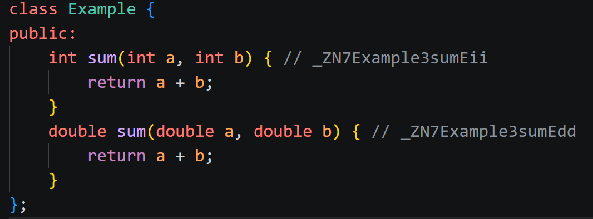
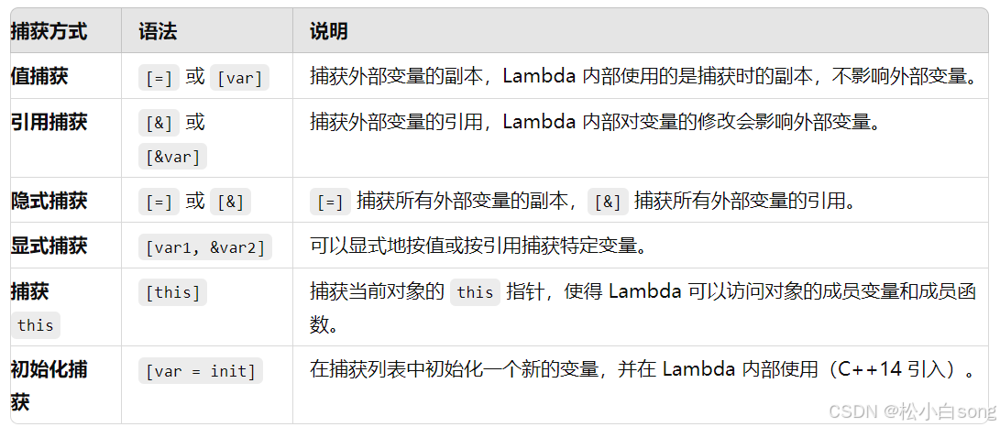
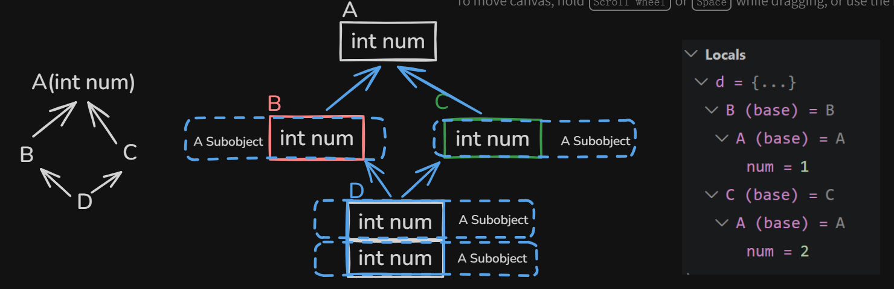
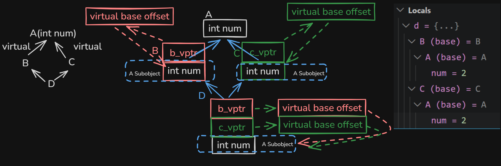

# 关键字

## static

控制变量的存储位置，作用域和生命周期。

- 静态局部变量  

1. 存储位置由栈区变为静态数据区，作用域仍是一个局部作用域，生命周期延长到整个程序执行结束。
2. 该变量的内存只被分配且初始化一次，因此其值在下次调用时仍维持上次的值。  

- 静态全局变量/函数  

1. 作用域仅限于当前源文件，其他源文件无法访问，防止命名冲突，模块级封装；
2. 在 C++ 中，匿名命名空间（namespace） 通常优于 static。

- 静态成员变量  

1. 只存在一个副本，为类以及其所有的对象所有，可以通过类和对象去调用；
2. 必须在类外定义，例如 `int Counter::count = 0;`；
3. 存储区：全局/静态区。生命周期：整个程序周期；
4. 使用场景：统计对象数量，全局配置，类级别共享状态。

- 静态成员函数  

1. 属于一个类而不是属于此类的任何特定对象，不接收 `this` 指针。
2. 只能访问类的静态成员变量和静态成员函数。
3. 可以通过类和对象去调用，通过对象去调用，本质仍是类级调用。
4. 使用场景：工具函数（Utility），工厂方法（Factory），与类强相关、但不依赖对象状态的逻辑。
   
## extern

声明外部变量/函数（其它文件定义的），不分配内存。

- 修饰变量/函数

表示其在此处声明引用，在别处定义的，分离声明与定义，防止重复定义。 
函数声明默认带有 `extern`，无需显式写出。

- 优化编译

调用其它文件中的变量/函数，可以用`#include`包含进来，为啥要用 `extern` ？
因为用 `extern` 会加速程序的编译过程，节省时间。

- 用于指示 `C` 或者 `C++` 函数的调用规范，兼容 `C` 语言。

在 `C++` 中调用`C` 库函数，`extern “C”` 声明要引用的函数。
告诉链接器在链接的时候用 `C` 函数规范来链接。
主要原因是 `C++` 和 `C` 程序编译完成后在目标代码中命名规则不同，解决名字匹配的问题。

- extern 与 static 的关系：

extern 使变量 / 函数具有外部链接属性（跨文件可见）。
static 使变量 / 函数具有内部链接属性（仅当前文件可见）。

## volatile

与const相反，表示该变量随时可能发生变化。

- 易变性  

从内存中重新装载内容，而不是直接从寄存器拷贝内容。 

- 不可优化特性  

确保本条指令不会被优化而省略，一定被执行。  

- 顺序性  

保证变量间的顺序性，编译器不会进行乱序优化。 

## const

常量限定符，告知编译器该变量是不可修改的

- 修饰基本数据类型  

1. 修饰一般常量及数组，放在类型说明符前或后(`const int` & `int const`)。  
2. 修饰指针变量， `const int *ptr`，ptr指向的变量为常量；`int *const ptr`，ptr指针本身是常量。

- 应用到函数中  

1. 修饰参数，修饰的参数在函数内不能修改。 
2. 修饰返回值，修饰的返回值在函数外不能修改。

- 在类中的用法  

1. 修饰非静态成员变量，仅在类内或初始化列表中初始化。  
2. 修饰静态成员变量，在类内初始化或类外初始化。
3. 修饰非静态成员函数，不能修改所在类的的非静态成员变量，重载函数的一个方式。  
4. 不可修饰静态成员函数，`const`保证非静态成员变量不能修改，静态成员函数没有this，
   无法访问非静态成员，因此 const 的概念对它没有意义。

- 修饰类对象，定义常量对象  

只能调用非静态常量成员函数，别的非静态成员函数都不能调用。
可以调用静态成员函数，静态成员函数没有this，不访问对象的内容，不会影响对象const的属性。

## constexpr

在编译期确定（编译期常量），变量必须用常量表达式初始化。

- 与 `const` 区别

const 表示“只读”的语义，constexpr 表示“常量”的语义。
constexpr 只能定义编译期常量，而 const 可以定义编译期常量，也可以定义运行期常量。
成员函数标记为constexpr，则顺带也将它标记为了const。如果将一个变量标记为constexpr，则同样它是const的。
但相反并不成立，一个const的变量或函数，并不是constexpr的。

- 变量

复杂系统中很难分辨一个初始值是不是常量表达式，可以将变量声明为constexpr类型，由编译器来验证变量的值是否是一个常量表达式。
必须使用常量初始化：

 ```c++ 
  constexpr int n = 20;
  constexpr int m = n + 1;
  static constexpr int MOD = 1000000007;
```

如果constexpr声明中定义了一个指针，constexpr仅对指针有效，和所指对象无关。

 ```c++ 
constexpr int* p1 = nullptr; // 编译期常量指针，指针值在编译期已知，语义类似 int* const
```

- 函数

用于常量表达式的函数。

函数的返回类型和所有形参类型都是字面值类型，函数体有且只有一条return语句。

```c++
constexpr int new() {return 42;}
```

为了可以在编译过程展开，constexpr函数被隐式转换成了内联函数。
constexpr和内联函数可以在程序中多次定义，一般定义在头文件。

- 构造函数

构造函数不能说const，但字面值常量类的构造函数可以是constexpr。
constexpr构造函数必须有一个空的函数体，即所有成员变量的初始化都放到初始化列表中。对象调用的成员函数必须使用 constexpr 修饰

- 好处
  
1. 为一些不能修改数据提供保障，写成变量则就有被意外修改的风险。
2. 有些场景，编译器可以在编译期对constexpr的代码进行优化，提高效率。
3. 相比宏来说，没有额外的开销，但更安全可靠。

## sizeof

编译时一元操作符，用于获取变量或类型所占用的字节数。

- 一个空类/结构体的对象占1个字节，单一继承空类的派生对象的基类成分占0个字节，虚继承涉及到虚指针所以占一个指针大小；  

- 数组的长度  

若指定了数组长度，则不看元素个数，总字节数 = 数组长度 * sizeof（元素类型）;
若没有指定长度，则按实际元素个数类确定。Ps：若是字符数组，则应考虑末尾的空字符。
数组作为函数参数，会退化为指针。

- 结构体对象的长度  

在默认情况下，为方便对结构体内元素的访问和管理，当结构体内元素长度小于处理器位数的时候，
便以结构体内最长的数据元素的长度为对齐单位，即为其整数倍。
若结构体内元素长度大于处理器位数则以处理器位数为单位对齐。

- 对函数使用 `sizeof`，在编译阶段会被函数的返回值的类型代替；

- `sizeof` 后如果是类型名则必须加括号，如果是变量名可以不加括号，这是因为 `sizeof` 是运算符；

- 当使用结构类型或者变量时，`sizeof` 返回实际的大小。

- 当使用静态数组时返回数组的全部大小，`sizeof` 不能返回动态数组或者外部数组的尺寸。

## inline

特征：  

相当于把内联函数里面的内容写在调用内联函数处；  
相当于不用执行进入函数的步骤，直接执行函数体；  
相当于宏，却比宏多了类型检查，真正具有函数特性；  
编译器一般不内联包含循环、递归、switch 等复杂操作的内联函数；  
在类声明中定义的函数，除了虚函数的其他函数都会自动隐式地当成内联函数。  

优点：  

内联函数同宏函数一样将在被调用处进行代码展开，省去了参数压栈、栈帧开辟与回收，结果返回等，从而提高程序运行速度。
内联函数相比宏函数来说，在代码展开时，会做安全检查或自动类型转换（同普通函数），而宏定义则不会。
在类中声明同时定义的成员函数，自动转化为内联函数，因此内联函数可以访问类的成员变量，宏定义则不能。
内联函数在运行时可调试，而宏定义不可以。

缺点：  

代码膨胀。内联是以代码膨胀（复制）为代价，消除函数调用带来的开销。如果执行函数体内代码的时间，相比于函数调用的开销较大，那么效率的收获会很少。另一方面，每一处内联函数的调用都要复制代码，将使程序的总代码量增大，消耗更多的内存空间。  
inline 函数无法随着函数库升级而升级。inline函数的改变需要重新编译，不像 non-inline 可以直接链接。是否内联，程序员不可控。内联函数只是对编译器的建议，是否对函数内联，决定权在于编译器。  


# 基础

## 静态局部变量，全局变量，局部变量的特点

|分类|局部变量|静态局部变量|全局变量|
|---|---|---|---|
|作用域|当前函数或者代码块内|当前函数内部|整个程序内 |
|生命周期|函数或代码块作用域|程序运行期间|程序运行期间|
|初始化|默认值不确定|初始化一次（默认0）|默认初始化为0|
|存储位置|栈区（stack）|数据段或 BSS 段（非栈）|数据段或 BSS 段|

## 指针(*)与引用(&)的区别

指针是存储地址的独立变量，可重新赋值、可为空、支持算术运算，但需要手动管理内存。
引用是变量的别名，必须初始化、不能为空、绑定后不可更改，编译器不为其分配独立存储空间。

- 指针是个存储内存地址的变量，引用是原变量的别名；
- 指针可以为空，引用不能为空，定义时必须初始化；
- 指针会出现野指针和空指针等不安全情况，引用不会；
- 指针初始化后可以改变，引用初始化后就不会再改变（不能再引用别的变量）；
- 指针大小是指针变量本身大小（32位系统4字节，64位系统8字节），引用大小是所引用的变量的大小；
- 指针需要解引用（*）访问目标值，引用不需要；
- 指针的算术是移动地址，引用的算数是值的加减；
- 原来对象销毁了，指针和引用都会出问题；

## 前置++与后置++

为了区分前后置，重载函数是以参数类型来区分，在调用的时候，编译器默默给int指定为一个0

```c++
self &operator++() {
    node = (linktype)((node).next);
    return *this;
}

const self operator++(int) {
    self tmp = *this;
    ++*this;
    return tmp;
}
```

- 为什么后置返回对象，而不是引用
 
因为后置为了返回旧值创建了一个临时对象，在函数结束的时候这个对象就会被销毁，
如果返回引用，那么我请问你？你的对象对象都被销毁了，你引用啥呢？

- 为什么后置前面也要加const

其实也可以不加，但是为了防止你使用i++++,连续两次的调用后置++重载符，为什么呢?
原因：它与内置类型行为不一致；你无法活得你所期望的结果，因为第一次返回的是旧值，而不是原对象，
你调用两次后置++，结果只累加了一次，所以我们必须手动禁止其合法化，就要在前面加上const。

- 处理用户的自定义类型

最好使用前置++，因为他不会创建临时对象，进而不会带来构造和析构而造成的格外开销。

## std::atomic

a++ 和 int a = b 在C++中是否是线程安全的？答案：不是。
从C/C++语法的级别来看，这是一条语句，应该是原子的；但从编译器得到的汇编指令来看，其实不是原子的

## 函数指针

函数指针是指向函数的指针变量。它可以用于存储函数的地址，允许在运行时动态选择要调用的函数。

使用场景：

- 回调函数： 函数指针常用于实现回调机制，允许将函数的地址传递给其他函数，以便在适当的时候调用。
- 函数指针数组： 可以使用函数指针数组实现类似于状态机的逻辑，根据不同的输入调用不同的函数。
- 动态加载库： 函数指针可用于在运行时动态加载库中的函数，实现动态链接库的调用。
- 多态实现： 在C++中，虚函数和函数指针结合使用，可以实现类似于多态的效果。
- 函数指针作为参数： 可以将函数指针作为参数传递给其他函数，实现一种可插拔的函数行为。
- 实现函数映射表： 在一些需要根据某些条件调用不同函数的情况下，可以使用函数指针来实现函数映射表。

和指针函数的区别，指针函数是一个返回指针类型的函数，用于返回指向某种类型的数据的指针。

## struct和class的区别

结构体中成员的默认属性是public，而类中成员的默认属性是private。


相同点：

如果结构体没有定义任何构造函数，编译器会生成默认的无参数构造函数。如果类没有定义任何构造函数，编译器也会生成默认的无参数构造函数。

不同点：

- struct用于表示一组相关的数据，而class用于表示一个封装了数据和操作的对象。
如果只是用来组织一些数据，而不涉及复杂的封装和继承关系，struct可能更直观；如果需要进行封装、继承等面向对象编程的特性，可以选择使用class。
- struct结构体中的成员默认是公有的（public）。类中的成员默认是私有的（private）。
- struct 继承时默认使用公有继承。class 继承时默认使用私有继承。

## 结构体和联合体的区别

都是用户定义的类型，结构体所有成员同时存在且占用独立内存空间，而联合体所有成员共享同一内存空间，仅能存储一个成员的值。
C++11后，联合体可以包含非POD类型成员，并支持成员函数和特殊成员函数。

## C++强制类型转换

关键字：static_cast、dynamic_cast、reinterpret_cast和 const_cast

- static_cast

没有运行时类型检查来保证转换的安全性。
进行上行转换（把派生类的指针或引用转换成基类表示）是安全的。
进行下行转换（把基类的指针或引用转换为派生类表示），由于没有动态类型检查，所以是不安全的。

使用：
1. 用于基本数据类型之间的转换，如把int转换成char。
2. 把任何类型的表达式转换成void类型。

- dynamic_cast

在进行下行转换时，dynamic_cast具有类型检查（信息在虚函数中）的功能，比static_cast更安全。
转换后必须是类的指针、引用或者void*，基类要有虚函数，可以交叉转换。
dynamic本身只能用于存在虚函数的父子关系的强制类型转换；
对于指针，转换失败则返回nullptr，对于引用，转换失败会抛出异常。

- reinterpret_cast

可以将整型转换为指针，也可以把指针转换为数组；可以在指针和引用里进行肆无忌惮的转换，平台移植性比价差。

- const_cast

常量指针转换为非常量指针，并且仍然指向原来的对象。常量引用被转换为非常量引用，并且仍然指向原来的对象。去掉类型的const或volatile属性。

## c++的多态

静态多态（编译器多态）和动态多态（运行时多态）。

静态多态：函数重载实现，编译期，早绑定；  
动态多态：虚函数重写，运行期，晚绑定；  

## 函数重载(overload)和函数重写(override)的区别

函数重载就在允许在相同作用域（类）中存在多个功能类似的同名的函数，这些函数的参数表不同（参数个数或者参数类型或者参数排列顺序不同），const关键字也可以区分。
注意：不能通过函数返回值类型来区分重载。
原理：函数名修饰（Name Mangling）。编译器根据函数不同的形参表对同名函数的名称做修饰，然后这些同名函数就成了不同的函数。
tips: 通过 `objdump -t` 查看符号表。

_ZN7Example3sumEii： 前缀_Z表示这是一个 C++ 修饰名（Itanium ABI 规范），7代表Example长度，3代表sum长度， E代表嵌套名称的结束标记。
  
重写就是派生类重新定义基类的虚函数，函数签名（函数名、参数、返回值）完全相同， 使用virtual 和 override 关键字。 每个类维护一个虚函数表，每个对象构造时会初始化一个虚函数表指针，该虚函数表指针指向一个虚函数表。虚函数表是一维数组，里面是一组虚函数地址，指向每个虚函数。

``` c++
class Base {
public:
    virtual void display() {
        cout << "Base class display function" << endl;
    }
    int num;
};

class Derived : public Base {
public:
    void display() override {
        cout << "Derived class display function" << endl;
    }
};

Vtable for Base
Base::_ZTV4Base: 3 entries
0     (int (*)(...))0
8     (int (*)(...))(& _ZTI4Base)
16    (int (*)(...))Base::display

Class Base
   size=16 align=8
   base size=12 base align=8
Base (0x0x13d06060) 0
    vptr=((& Base::_ZTV4Base) + 16)

Vtable for Derived
Derived::_ZTV7Derived: 3 entries
0     (int (*)(...))0
8     (int (*)(...))(& _ZTI7Derived)
16    (int (*)(...))Derived::display

Class Derived
   size=16 align=8
   base size=12 base align=8
Derived (0x0x13cc47b8) 0
    vptr=((& Derived::_ZTV7Derived) + 16)
Base (0x0x13d06240) 0
      primary-for Derived (0x0x13cc47b8)
```

重载的确定是在编译时静态绑定的；虚函数则是在运行时动态绑定。

## c++11的新特性

统一的列表初始化， initializer_list， decltype，右值引用，万能引用
新的默认成员函数：移动构造和移动赋值，关键字default/delete，可变参数模板
emplace，lambda表达式，function包装器，bind

## c++编译器默认编写并调用哪些函数

默认构造函数，析构函数，copy构造函数和copy assignment操作符

## c++智能指针

- shared_ptr： 共享式拥有，多个智能指针可以共享同一个对象，对象的最末一个拥有者有责任销毁对象，
并清理与该对象相关的所有资源；
- unique_ptr：独占式拥有，意味着可以确保一个对象和其相应的资源同一时间只被一个 pointer 拥有。
一旦拥有者被销毁或编程 empty，或开始拥有另一个对象，先前拥有的那个对象就会被销毁，其任何相应资源亦会被释放；
- weak_ptr：允许你共享但不拥有某对象，引用对象不会加1（弱引用），一旦最末一个拥有该对象的智能指针失去了所有权，
任何 weak_ptr 都会自动成空（empty）。可以解决环状引用的问题，因此，在 default 和 copy 构造函数之外，
weak_ptr 只提供 “接受一个 shared_ptr” 的构造函数；
- auto_ptr（被 C++11 弃用）原因是缺乏语言特性如 “针对构造和赋值” 的 std::move 语义，以及其他瑕疵。

## lambda表达式有几种捕获方式



## 怎么避免指针指向的资源被重复释放两次？

shared_ptr, unique_ptr, weak_ptr, auto_ptr（被 C++11 弃用）

## auto_ptr 与 unique_ptr 比较

auto_ptr 可以赋值拷贝，复制拷贝后所有权转移；unqiue_ptr 无拷贝赋值语义，但实现了move 语义；  
auto_ptr 对象不能管理数组（析构调用 delete），unique_ptr 可以管理数组（析构调用 delete[] ）；

## c++的容器

vector和list的区别

## 数组([])和指针(*)的区别

- 数组要么在全局数据区被创建，要么在栈上被创建；指针可以随时指向任意类型的内存块；  
- 修改内容上的差别：

``` c++
char a[] = “hello”;
a[0] = ‘X’;
char *p = “world”; // 注意p指向常量字符串
p[0] = ‘X’; // 编译器不能发现该错误，运行时错误
``` 

- 用运算符`sizeof` 可以计算出数组的容量（字节数）。  

`sizeof(p)`, p 为指针得到的是一个指针变量的字节数，而不是p 所指的内存容量。
C/C++ 语言没有办法知道指针所指的内存容量，除非在申请内存时记住它。
注意当数组作为函数的参数进行传递时，该数组自动退化为同类型的指针.

## `sizeof` 与 `strlen` 的区别

- `sizeof` 是运算符，而 `strlen` 是函数；  
- `sizeof` 其参数可以是任意类型、变量和函数，`strlen` 只能用`char*` 做参数，且必须是以 `’\0’` 结尾；  
- 返回值类型都为 `size_t（unsigned int）`；  
- 数组作 `sizeof` 的参数时不会退化为指针，而传递给 `strlen` 是就退化为指针；  
- `sizeof` 编译时的常量，而 `strlen` 要到运行时才会计算出来，且是字符串中字符的个数而不是内存大小；

## `const` 和 `#define` 的区别

`const` 和 `#define` 都可以定义常量，但是区别在于：

|宏定义 #define             |   const 常量    |
|---|---|
|字符替换     |   常量声明    |
|预处理器处理               |   编译器处理    |
|无类型安全检查             |   有类型安全检查    |
|不分配内存                 |   要分配内存    |
|存储在代码段               |   存储在数据段    |
|可通过 #undef 取消         |   不可取消    |

## nullptr与NULL的区别

|特性|nullptr|NULL|
|---|---|---|
|定义|C++11关键字|宏，通常为表示整形为0或(void*)0|
|类型|std::nulltpr_t|整数常量|
|类型安全性|强|弱|
|转换为整数|不可以|可以|
|推荐使用|是|不是|

## `define` 和 `typedef` 的区别

define
- 只是简单的字符串替换，没有类型检查；
- 在编译的预处理阶段起作用；
- 可以用来防止头文件重复引用；
- 不分配内存，给出的是立即数，有多少次使用就进行多少次替换；

typedef
- 有对应的数据类型，是要进行判断的
- 在编译、运行的时候起作用；
- 在静态存储区中分配空间，在程序运行过程中内存中只有一个拷贝


## 全局变量和局部变量的区别

- 生命周期不同：全局变量随主程序创建而创建（在main函数之前），随主程序销毁而销毁； 局部变量在局部函数内部，甚至局部循环体等内部存在，退出就不存在；  
- 作用域不同：全局变量程序的各个部分都可以用到；局部变量只能在局部使用；  
- 内存位置不同：全局变量分配在全局数据段并且在程序开始运行的时候被加载，局部变量则分配在堆栈里面。

## 文件包含用尖括号和引号的区别

尖括号(<...>)是从系统包含目录中搜索该文件，不会在源文件目录搜索（有待验证）；  
引号("...")是从源文件目录中搜索该文件，找不到会在系统包含目录中搜索。  
Linux 系统目录 `/usr/include /usr/local/include`

## c 与 c++ 各自特点

`C` 面向过程，一种结构化语言，重点在于算法和数据结构，考虑的是如何通过一个过程，
对输入（或环境条件）进行处理得到输出（或实现过程（事务）控制）。  
`c++` 面向对象，考虑的是如何构造一个对象模型，让这个模型能够契合与之对应的问题域，
这样就可以通过获取对象的状态信息得到输出或实现过程（事务）控制。

## 访问级别

|继承方式|基类 public 成员|基类 protected 成员|基类 private 成员|
|---|---|---|---|
|public 继承|public|protected|不可访问（子类也看不见）| 
|protected 继承|protected|protected|不可访问（子类也看不见）|
|private 继承|private|private|不可访问（子类也看不见）|


## derived classes 是否可重新定义继承而来的 `private` virtual 函数？

``` c++
    class Base {
    public:
        virtual ~Base() = default;
    private:
        virtual void f(){} // private virtual function
    };
    class Derived :public Base {
    private:
        virtual void f() override {} // override the function f() of base class
    };
```

## 什么情况下需要在初始化列表进行初始化？

四种情况：  
- 当初始化一个 `reference member` 时；（声明时必须初始化）
- 当初始化一个 `const member` 时；（声明时必须初始化）
- 当调用一个 `base class` 的 `constructor`，而它拥有一组参数时； （无默认构造函数）
- 当调用一个 `member class` 的 `constructor` ，而它拥有一组参数时； （无默认构造函数）

``` c++
error: call to implicitly-deleted default constructor of 'Derived'
```

## 多态类中的虚函数表是 `Compile-Time`，还是 `Run-Time` 时建立的？

虚函数表是在编译期就建立了,各个虚函数这时被组织成了一个虚函数的入口地址的数组。
而对象的隐藏成员虚函数表指针是在运行期,也就是构造函数被调用时进行初始化的，
这是实现多态的关键。

## 为什么构造函数不能为虚函数？

- 构造一个对象的时候，必须知道对象的实际类型，而虚函数行为是在运行期间确定实际类型的。
而在构造一个对象时，由于对象还未构造成功。编译器无法知道对象的实际类型，是该类本身，
还是该类的一个派生类，或是更深层次的派生类。  
- 虚函数的执行依赖于虚函数表。而虚函数表在构造函数中进行初始化工作，即初始化vptr，
让他指向正确的虚函数表。而在构造对象期间，虚函数表还没有被初始化，将无法进行。

## 为什么基类析构函数是虚函数？

编译器总是根据类型来调用类成员函数。但是一个派生类的指针可以安全地转化为一个基类的指针。 这样删除一个基类的指针的时候，C++不管这个指针指向一个基类对象还是一个派生类的对象， 调用的都是基类的析构函数而不是派生类的。如果你依赖于派生类的析构函数的代码来释放资源，而没有重载析构函数，那么会有资源泄漏。

## `malloc/free`和 `new/delete`区别

new/delete 底层调用了 malloc/free 函数。对于内置类型数据而言，二者没有多大区别。

|  new/delete | malloc/free |
|---|---|
| C++运算符 | C标准库函数 |
| new 自动计算所需分配内存大小 | malloc 手动计算 |
| new 是在 自由存储区free store上分配内存 | malloc 堆上分配 |
| new 内存分配失败时，会抛出bad_alloc异常 | malloc分配内存失败时，返回NULL |
| new 返回对象类型的指针 | malloc返回void *，之后类型转换，有类型安全问题 |
| delete 需要对象类型的指针 | free是void *类型指针 |
| 可以被重载 | 不可以被重载 |
| 会调用对象的构造函数/析构函数 | 不会调用对象的构造函数/析构函数 |

## 面向对象技术的基本概念是什么，三大特性是什么？

基本概念：类、对象、继承；  
三大特性：封装、继承、多态。

封装：把数据和操作打包在类里，通过 public/private/protected 控制访问权限，外部只能通过接口操作，不能直接改内部数据。
继承：子类继承父类的属性和方法，在原来基础上进行扩展，避免重复代码，增加代码复用性。
多态：同一接口，不同对象调用表现不同。分编译时多态（静态多态）（函数重载、模板）和运行时多态（动态多态）（虚函数 + 继承）。

## 函数（virtual）可以是内联函数（inline）吗？

- 虚函数可以是内联函数，内联是可以修饰虚函数的，但是当虚函数表现多态性的时候不能内联。
- 内联是在编译期建议编译器内联，而虚函数的多态性在运行期，编译器无法知道运行期调用哪个代码，
因此虚函数表现为多态性时（运行期）不可以内联。
- inline virtual 唯一可以内联的时候是：编译器知道所调用的对象是哪个类（如 Base::who()），
这只有在编译器具有实际对象而不是对象的指针或引用时才会发生。

## C++ 中有 `malloc/free`，为什么还有 `new/delete`？

`malloc/free` 是C标准库函数，`new/delete` 是C++运算符。
对于内置类型数据而言，二者没有多大区别。  
`malloc` 申请内存的时候要制定分配内存的字节数，而且不会做初始化；
`new` 申请的时候有默认的初始化，同时可以指定初始化；  
对于类类型的对象而言，用 `malloc/free` 无法满足要求的。
对象在创建的时候要自动执行构造函数，消亡之前要调用析构函数。
由于 `malloc/free` 是库函数而不是运算符，不在编译器控制之内，
不能把执行构造函数和析构函数的任务强加给它，因此，C++ 还需要 `new/delete`。

## 头文件中的 `ifndef define endif` 的作用

防止该头文件被重复引用，这是C++预编译头文件保护符，保证即使文件被多次包含，头文件也只定义一次。


## 目标文件存储结构段                                                                             功能

| 文件头 | 描述 |
|---|---|
|File Header |                   文件头，描述整个文件的文件属性（包括文件是否可执行、是静态链接或动态连接及入口地址、目标硬件、目标操作系统等）|
|.text section |                代码段，执行语句编译成的机器代码|
|.data section |                数据段，已初始化的全局变量和局部静态变量|
|.bss section |                  BSS 段（Block Started by Symbol），未初始化的全局变量和局部静态变量（因为默认值为 0，所以只是在此预留位置，不占空间）|
|.rodata section |              只读数据段，存放只读数据，一般是程序里面的只读变量（如 const 修饰的变量）和字符串常量|
|.comment section |            注释信息段，存放编译器版本信息|
|.note.GNU-stack section |   堆栈提示段|

## 堆和栈的区别

- 申请方式不同：栈由系统自动分配和释放，堆由程序员自己申请并指明大小；  
- 空间大小不同：栈是向低地址扩展，连续的内存区域，大小很有限； 堆是向高地址扩展，是不连续的内存区域，空间相对大且灵活；  
- 执行效率不同：栈由系统分配和释放速度快；堆由程序员控制，一般较慢，且容易产生碎片；

## 空指针和悬垂指针的区别

空指针是指被赋值为 `NULL` 的指针；`delete`  指向动态分配对象的指针将会产生悬垂指针。  

- 空指针可以被多次delete，而悬垂指针再次删除时程序会变得非常不稳定；  
- 使用空指针和悬垂指针都是非法的，而且有可能造成程序崩溃，

如果指针是空指针，尽管同样是崩溃，和悬垂指针相比是一种可预料的崩溃。

## 什么是多重继承？

一个类可以从多个基类（父类）继承属性和行为。
多重继承可能引入一些问题，如菱形继承问题。

## 怎么解决菱形继承问题？

菱形继承：前提是 C++ 具备多重继承的语言特性。
一个子类继承多个父类，这些父类又继承相同的父类，就会出现菱形继承。



问题： D中有两份A的成员变量，一份从B继承而来，一份从C继承而来，可能有不同的值，带来如下两个问题：

1. 存储空间的浪费。
2. 二义性。

解决方案： 虚继承，在继承声明中使用 virtual 关键字，可以避免在派生类中生成多个基类的实例。派生类具有唯一基类的实例，通过虚表内的虚基类偏移找到唯一基类的实例，从而解决了菱形继承带来的存储空间浪费和二义性。



tips: gcc通过-fdump-lang-class 选项查看类信息。